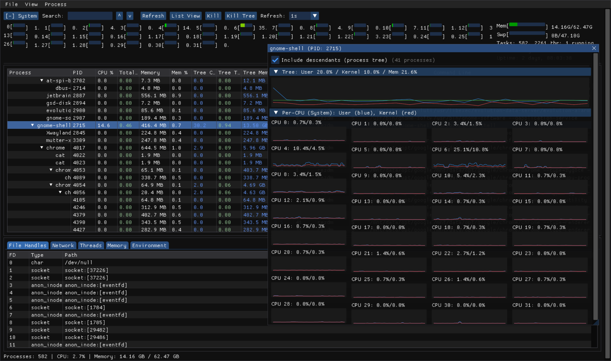

# PEX - Process Explorer for Linux 

A Linux process explorer similar to Windows Process Explorer.

## Why

I needed a one-off tool that would show me alltogether a process tree (think of pstree, ps -ef --forest or htop) but combined with network info. In Windows I'm using (since it appeared actually) Process Explorer and did not find anything alike for \*ix. Even though I am a FreeBSD and Solaris evangelist, this time it is for Debian Linux + Wayland only.

It is AI generated code, it is a one-off project, not sure it makes sense to continue it, I needed it once and found it useful to have it on my computer.

## Screenshot



## Requirements

Debian, Wayland, libxkb, ...

## Building

```bash
git clone https://github.com/rezdm/pex.git && cd pex
mkdir build && cd build
cmake ..
make -j$(nproc)
```

## Installing
```bash
#git clone...
cd pex
mkdir build && cd build && cmake .. && make -j$(nproc)
```
Copy pex executable and pex.png to a folder of choice and set capabilities:
```bash
sudo setcap 'cap_sys_ptrace,cap_dac_read_search,cap_kill+ep' {path-to-executable-location}/pex
```

May be create .desktop file for GNOME:
```
[Desktop Entry]
Name=PEX
Comment=Process Explorer for Linux
Exec=pex
Icon=pex
Terminal=false
Type=Application
Categories=System;Monitor;
Keywords=process;monitor;system;task;manager;
```

Add this pex.desktop to ~/.local/share/applications/

For the icon to appear in app menus:
```bash
mkdir -p ~/.local/share/icons/hicolor/256x256/apps
cp {path-to-proect source}/pex.png ~/.local/share/icons/hicolor/256x256/apps/pex.png
update-desktop-database ~/.local/share/applications/
```

Makes sense to crop/resize original logo into destination (with ImageMagic):
```bash
convert {path-to-project-source}/pex-logo.png -gravity center -crop 800x800+0+0 +repage -resize 256x256 {path-to-installation-folder/pex.png 
```

I am considering adding this to start it the same way as in Windows:
```bash
gsettings set org.gnome.settings-daemon.plugins.media-keys custom-keybindings "['/org/gnome/settings-daemon/plugins/media-keys/custom-keybindings/pex/']"
dconf write /org/gnome/settings-daemon/plugins/media-keys/custom-keybindings/pex/name "'PEX'"
dconf write /org/gnome/settings-daemon/plugins/media-keys/custom-keybindings/pex/command "'$HOME/projects/pex/pex.cpp/build/pex'"
dconf write /org/gnome/settings-daemon/plugins/media-keys/custom-keybindings/pex/binding "'<Control><Shift>Escape'"
```

