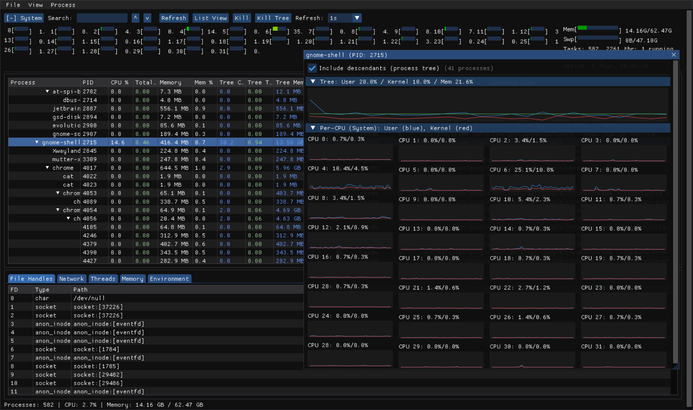
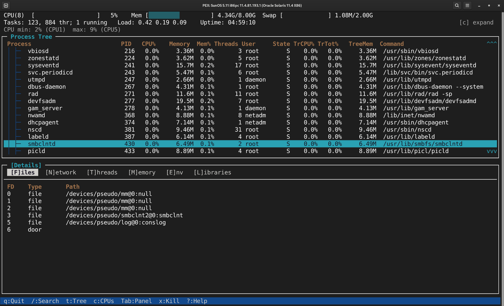

# PEX - Process Explorer for Linux

[](https://github.com/rezdm/pex/actions/workflows/cmake-multi-platform.yml)
[](https://github.com/rezdm/pex/actions/workflows/codeql.yml)

A Linux process explorer similar to Windows Process Explorer. Also runs on FreeBSD and Solaris.

## Why

I needed a one-off tool that would show me alltogether a process tree (think of pstree, ps -ef --forest or htop) but combined with network info. In Windows I'm using (since it appeared actually) Process Explorer and did not find anything alike for \*ix. Even though I am a FreeBSD and Solaris evangelist, this time it is for Debian Linux + Wayland only.

It started as AI generated code for a one-off need, then turned out to be useful enough to keep developing.

## Features

* **Process tree / list** with per-process CPU% (per-core and total), memory, threads, user, state, executable path and command line; subtree aggregates (tree CPU/memory)
* **I/O rates** — per-process storage read/write bytes per second (Linux)
* **Details panel** for the selected process: open file handles, network connections (with async DNS/service-name resolution), threads, memory maps, environment variables, loaded libraries
* **History** — every refresh tick is recorded in memory (~10 min at 1 s refresh): per-process CPU (user/kernel split), memory and I/O rates plus system aggregates
  * Process popup charts show the recorded past the moment you open them
  * **History – Top Consumers** view (GUI): rank processes by average CPU / memory / I/O over the last 1 min / 5 min / all recorded, with trend sparklines — including processes that have already exited
  * Export everything to CSV for offline analysis
* **Difference highlighting** (Process Explorer style) — new processes flash green, exited processes linger as red ghost rows for one refresh interval. In the GUI the ghost stays *in place* (under its parent in tree view, in sorted position in list view); the TUI pins ghosts to the bottom of the process panel so they are visible regardless of scroll. Toggle in the GUI View menu (`diff_highlight` setting)
* **Process churn from the kernel** — with the event feed active (Linux proc connector, needs `cap_net_admin`, see [PRIVILEGES.md](PRIVILEGES.md); FreeBSD kqueue `EVFILT_PROC`), the system panel counts forks/execs/exits per tick, including short-lived processes that live and die between refreshes — the ones polling never sees
* **Find open file / handle** — search all processes for an open file, socket, pipe or loaded library by path substring (like Process Explorer's "Find Handle or DLL")
* **Kill** process or whole process tree (SIGTERM, escalate to SIGKILL), with PID-reuse guards
* **Search** by process name or command line, including processes under collapsed tree nodes
* **Show/hide kernel threads** toggle
* Single instance: launching pex again raises the existing window
* Settings (window size, view mode, panels, refresh interval) persist across runs in `~/.config/pex/pex.conf`; GUI window/table layout persists via `imgui.ini`

Two frontends, same data layer:
* `pex` — GUI (Dear ImGui + GLFW + OpenGL), works on X11 and Wayland
* `pexc` — ncurses TUI with near feature parity (no charts); ~5 MB RSS if memory matters

## Screenshots





## Keys

### GUI (pex)

| Key | Action |
|---|---|
| Ctrl+F | Focus search box |
| F3 / Shift+F3 | Next / previous search match |
| Ctrl+Shift+F | Find open file / handle |
| F5 | Refresh now |
| Delete (menu) | Kill process |
| Arrows, PgUp/PgDn, Home/End | Navigate process list |
| Double-click | Process details popup with history charts |

History – Top Consumers is in the **View** menu; CSV export is in the **File** menu.

### TUI (pexc)

| Key | Action |
|---|---|
| Up/k, Down/j, PgUp/PgDn, Home/g, End/G | Navigate |
| Enter/Right, Left | Expand / collapse tree node |
| `<` `>` (or `,` `.`), `0` | Horizontal scroll, reset |
| Tab | Switch panel focus |
| 1-6 | Details tab by number |
| `/`, n, N | Search, next/previous match |
| o | Find open file / handle |
| d | Dump recorded history to `~/pex-history-<timestamp>-{system,processes}.csv` |
| u | Show/hide kernel threads |
| x, K | Kill process / kill tree |
| s, c | Toggle system panel / expand per-CPU view |
| r / F5 | Refresh now |
| ? / F1 | Help |
| q | Quit |

## Requirements

Being able to compile (C++23, CMake >= 3.20). Tested to run on:
* Debian 13, GNOME/Wayland
* Gentoo, KDE/X11
* FreeBSD 15-RELEASE, XFCE/X11
* Solaris 11.4, GNOME/X11
* Solaris, Debian, FreeBSD: terminal

## Continuous integration

Every push and pull request builds across a matrix that varies OS, compiler and
C library (see [`.github/workflows/cmake-multi-platform.yml`](.github/workflows/cmake-multi-platform.yml)):

| Job | Covers |
|---|---|
| Ubuntu (latest) | GCC / glibc — primary Linux build (GUI + TUI) |
| Debian (latest) | GCC / glibc — Debian container |
| Ubuntu (clang) | Clang instead of GCC — catches GCC-isms and a different warning set |
| GCC 13 (C++23 floor) | pins the minimum toolchain (libstdc++ `std::format` landed in GCC 13.1) |
| Sanitizers (ASan+UBSan) | core + unit tests under Address/UndefinedBehavior sanitizers |
| Alpine (musl, TUI) | musl libc portability — TUI + core, GL stack skipped |
| FreeBSD (latest) | native build + tests in a FreeBSD VM |
| Solaris x86 (latest) | native build + tests in a Solaris VM |

Every job builds the binaries and runs the unit tests; a separate CodeQL
workflow runs static analysis. **GCC 13 is the minimum supported compiler.**

## Building

The build type defaults to `Release`; pass `-DCMAKE_BUILD_TYPE=Debug` for a
debug build.

### Linux (works)
```bash
git clone https://github.com/rezdm/pex.git && cd pex
mkdir build && cd build
cmake .. -DPEX_PLATFORM=linux
make -j$(nproc)
```

### Other (works, but not thoroughly tested through daily usage)
```bash
  -DPEX_PLATFORM=freebsd  # FreeBSD
  -DPEX_PLATFORM=solaris  # Solaris
```

To build only the TUI (no X11/OpenGL needed):
```bash
cmake .. -DBUILD_GUI=OFF
```

#### FreeBSD
I am using `pex` in FreeBSD 15-RELEASE, with XFCE, X11 in VirtualBox 7.2. Seems to work -- shows all that I need.
Note: per-process I/O byte counters and exact TCP states are not available through the FreeBSD APIs used; those columns show `-`/inferred values.

#### Solaris
I am testing `pex` on Solaris 11.4 CBE, with GNOME, X11 in VirtualBox 7.2. Works, but with an additional step, some workaround for libX11 limitation. libX11 itself resolves fine, but GLFW is reporting "Failed to load Xlib" likely because it can not `dlopen("libX11.so.6")` (hard-coded by GLFW) but my Solaris installation provides libX11.so.4. I did:
```bash
# cd pex/build...
mkdir lib
ln -s /usr/lib/64/libX11.so.4 ./lib/libX11.so.6
LD_LIBRARY_PATH=$PWD/lib ./pex
```
This is not correct, but at least allowes to test.
To see properties of other users' processes, set up an RBAC profile and run via `pfexec` — see [PRIVILEGES.md](PRIVILEGES.md).

## Console version
Additional functionality -- ncurses-based TUI version. Compiled by default together with GUI version. Not to build it:
```bash
... -DBUILD_TUI=OFF
```

The TUI also works with the system ncurses on Solaris 11.4:
```bash
cmake .. -DPEX_PLATFORM=solaris -DBUILD_GUI=OFF \
  -DCURSES_INCLUDE_DIR=/usr/include/ncurses \
  -DCURSES_LIBRARY=/usr/lib/64/libncursesw.so.6
```
(Mouse wheel-down needs ncurses mouse protocol v2 and is compiled out with the v1 system headers.)

### Challenges in Solaris
Solaris has its own curses library that interferes with code. User should either compile/install ncurses manually or rely on this project's `CMakeLists.txt` to retrieve it:
Compiling/installing manually, then:
```bash
rm -rf * && \
cmake ..\
  -DPEX_PLATFORM=solaris \
  -DCURSES_INCLUDE_DIR="/opt/ncurses6.6/include;/opt/ncurses6.6/include/ncursesw" \
  -DCURSES_LIBRARY=/opt/ncurses6.6/lib/libncursesw.a && \
gmake -j8 pexc
```
or build ncurses automatically during the build process:
```bash
cmake .. -DPEX_PLATFORM=solaris -DBUILD_NCURSES=ON
```

## Installing
```bash
#git clone...
cd pex
mkdir build && cd build && cmake .. && make -j$(nproc)
```
Copy pex executable and pex.png to a folder of choice and set capabilities:
```bash
sudo setcap 'cap_sys_ptrace,cap_dac_read_search,cap_kill,cap_net_admin+ep' {path-to-executable-location}/pex
```
pex runs fine without this — you just won't see details (files, network, environment, ...) of other users' processes, and the churn line stays hidden. `cap_kill` (kill others' processes) and `cap_net_admin` (kernel process-event feed) are optional — drop them if unwanted. For the full story per OS (Linux capabilities incl. a group-restricted variant, Solaris RBAC/pfexec, FreeBSD sudo/doas), see **[PRIVILEGES.md](PRIVILEGES.md)**.

May be create .desktop file for GNOME:
```
[Desktop Entry]
Name=PEX
Comment=Process Explorer for Linux
Exec=pex
Icon=pex
Terminal=false
Type=Application
Categories=System;Monitor;
Keywords=process;monitor;system;task;manager;
```

Add this pex.desktop to ~/.local/share/applications/

For the icon to appear in app menus:
```bash
mkdir -p ~/.local/share/icons/hicolor/256x256/apps
cp {path-to-proect source}/pex.png ~/.local/share/icons/hicolor/256x256/apps/pex.png
update-desktop-database ~/.local/share/applications/
```

Makes sense to crop/resize original logo into destination (with ImageMagic):
```bash
convert {path-to-project-source}/pex-logo.png -gravity center -crop 800x800+0+0 +repage -resize 256x256 {path-to-installation-folder/pex.png
```

### Ctrl+Shift+Esc, like in Windows
To start (or raise — pex is single-instance, a second launch raises the existing window) the same way as in Windows, bind a GNOME custom shortcut:
```bash
gsettings set org.gnome.settings-daemon.plugins.media-keys custom-keybindings "['/org/gnome/settings-daemon/plugins/media-keys/custom-keybindings/pex/']"
dconf write /org/gnome/settings-daemon/plugins/media-keys/custom-keybindings/pex/name "'PEX'"
dconf write /org/gnome/settings-daemon/plugins/media-keys/custom-keybindings/pex/command "'{path-to-executable-location}/pex'"
dconf write /org/gnome/settings-daemon/plugins/media-keys/custom-keybindings/pex/binding "'<Control><Shift>Escape'"
```

## Memory footprint
Most of the GUI's RSS (~150 MB) is the OpenGL/Wayland rendering stack, not pex itself (see issue #5 for measurements). If memory matters:
* use `pexc` (~5 MB), or
* run the GUI under XWayland: `WAYLAND_DISPLAY= ./pex` (saves ~50 MB by skipping libdecor/GTK client-side decorations)
